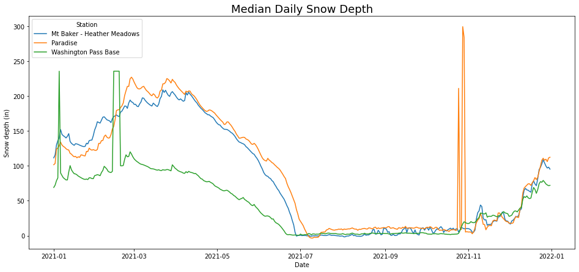

# nwac

A Python package for downloading historical Northwest Avalanche Center (NWAC) telemetry data. Currently, the package supports downloading historical telemetry data by year and weather station. 

This project is not affiliated with NWAC in any way. Please go to https://nwac.us/ to visit NWAC's website, and if you find their telemetry or forecasts useful please consider donating to them to help their nonprofit mission of providing avalanche information to help keep PNW backcountry users safe.


## Install

```bash
pip install nwac
```

## Usage

To see all of the available weather stations, use the `stations` function to get a Pandas Dataframe of station metadata:

```python
import nwac
nwac_stations = nwac.stations()
```

To download telemetry data, use the `download_historical_data` function. You can specify station names or ids along with years, or if you leave all function arguments blank it will download data from every NWAC station from 2014 to present. The downloading process will take ~ 10 minutes, so please consider only downloading data from the stations and timeframes that you require for your analysis. For example, if you just need 2021-2022 data for Hurricane Ridge:

```python
hurricane_ridge_data = nwac.download_historical_data(
    station_names=["Hurricane Ridge"],
    years=[2021, 2022]
)
```

Here let's plot daily median snow depth values for the Paradise, Heather Meadows, and Washington Pass Base stations for 2021:

```python
%matplotlib inline

import matplotlib.pyplot as plt
import pandas as pd
import seaborn as sns


# Data
nwac_data = nwac.download_historical_data(
    station_names=["Paradise", "Mt Baker - Heather Meadows", "Washington Pass Base"],
    years=[2021]
)
plotting_data = (
    nwac_data
    .assign(Date=lambda df: pd.to_datetime(df["Date_Time"]).dt.date)
    .groupby(["Station_Name", "Date"])
    ["Total_Snow_Depth"]
    .median()
    .reset_index()
    .assign(Date=lambda df: pd.to_datetime(df["Date"]))
    .rename(columns={"Station_Name":"Station"})
)

# Plot
plt.figure(figsize=(16, 7))
ax = sns.lineplot(data=plotting_data, x="Date", y="Total_Snow_Depth", hue="Station")
ax.set_title("Median Daily Snow Depth", fontsize=18)
ax.set(xlabel="Date", ylabel="Snow depth (in)")
plt.show()
```




## Development

I would welcome any feedback, suggestions, and most importantly contributions! Please feel free to open issues or pull requests here in this repo. To run the current `pytest` unit tests:

```bash
pytest tests/test_nwac.py
```

Ideas for future improvement:

* Downloader for historical avalanche forecasts
* Out-of-the-box sensible imputation/smoothing (look at the early November snow depths for Paradise above as an example of some obviously wrong data)

Thanks!
